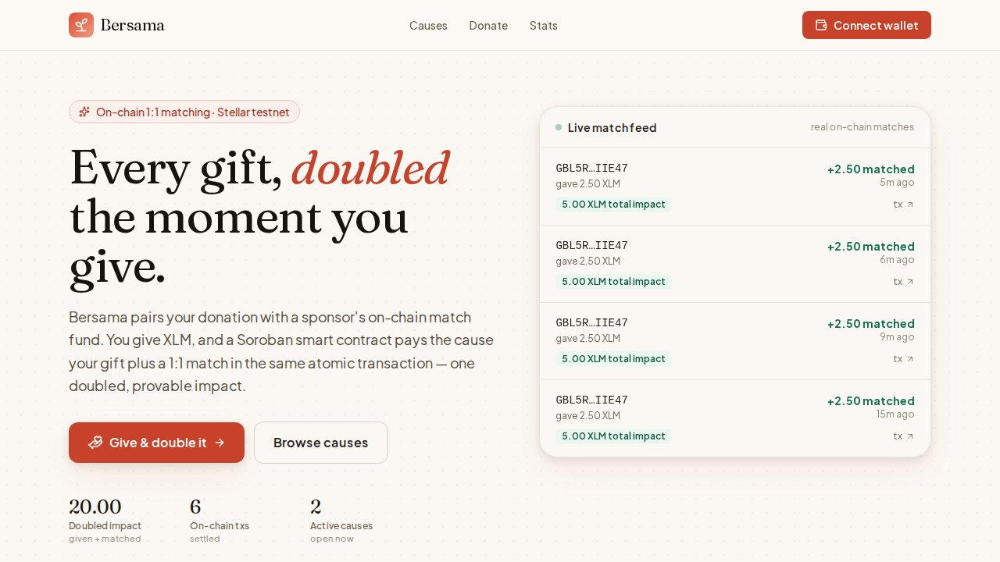
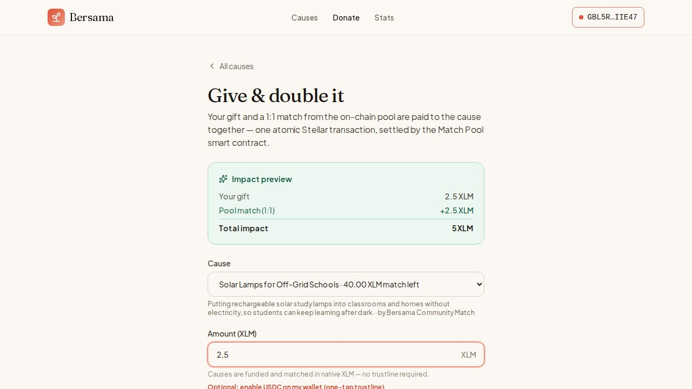
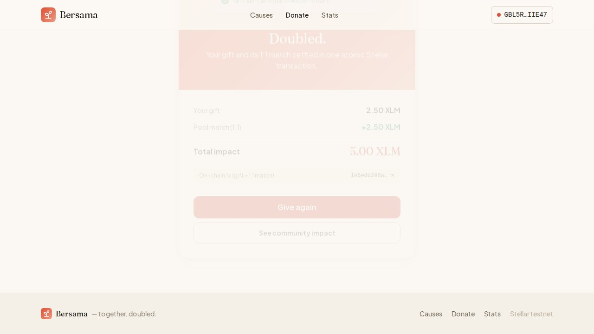
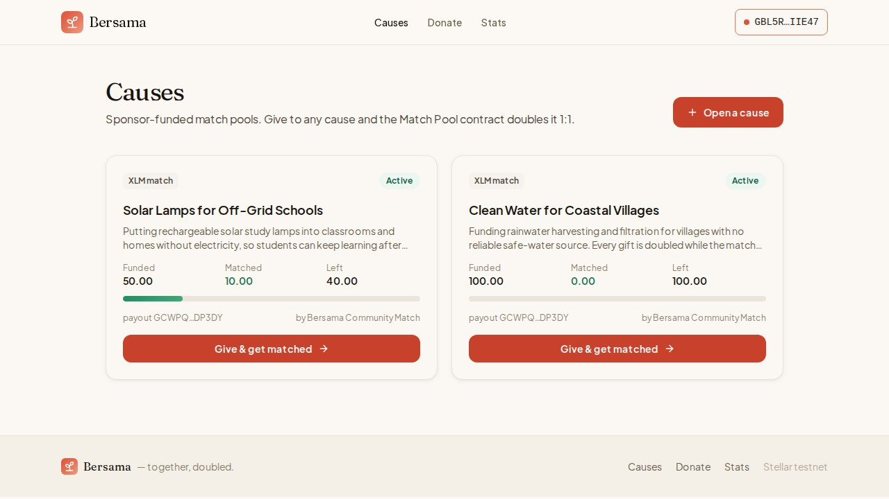
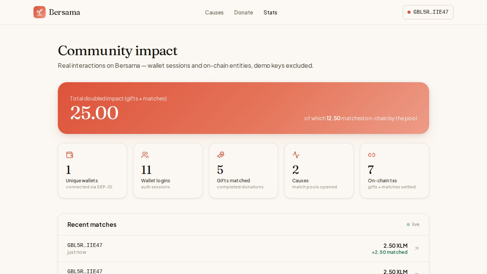
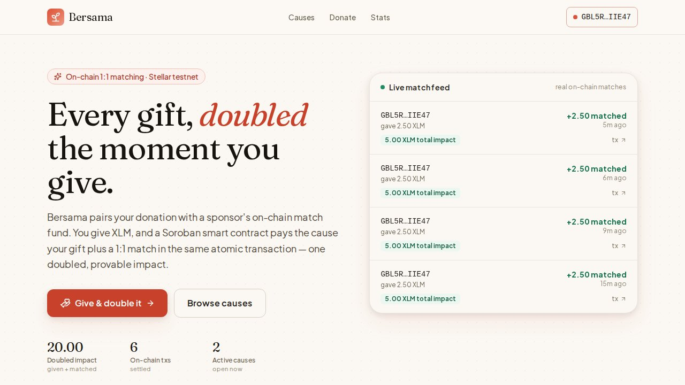
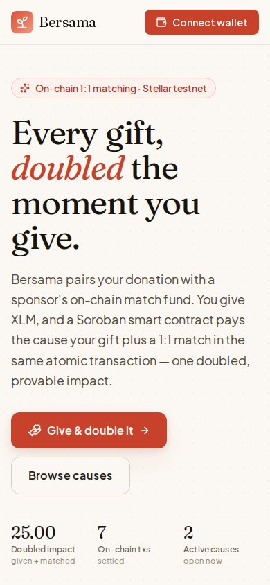
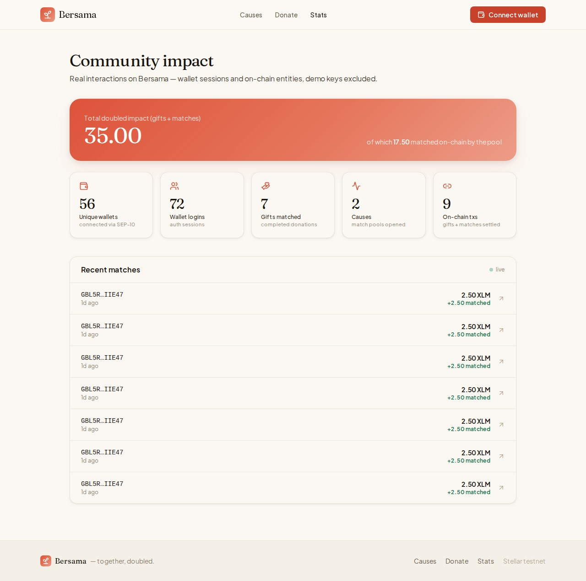

# Bersama

## Submission Checklist

### Delivery

- [x] **Public GitHub repository** — link to the public repo
- [x] **Minimum 20+ meaningful commits** — see commit history on `main`
- [x] **Live deployed application** — https://bersama-sigma.vercel.app
- [x] **PPT/Pitch deck link** — [View Pitch Deck](https://docs.google.com/presentation/d/1HxgQ6BSltgQBISpIbmgSTF5evFLcQDCe/edit?usp=sharing)
- [x] **Demo video link** — [Watch Demo](https://drive.google.com/file/d/14AS-9AG-u61FO4vvMe-WrtbxFWXH7AYm/view?usp=sharing)

### Proof

- [x] **Proof of 50+ users** — [50-user wallet list](docs/submission-proof.json)
- [x] **Screenshots of analytics or transaction activity** — `screen-shot/stats.jpg` and the on-chain Match Pool contract stats
- [x] **Updated README and documentation** — [proof package](docs/level5-proof-package.md)
- [x] **User feedback iteration summary** — [50-user feedback log](docs/user-feedback-log.md) and [improvement summary](docs/level5-feedback-iteration-summary.md)
- [x] **Google Sheet response export** — [open native Google Sheet](https://docs.google.com/spreadsheets/d/18DN7NqCgp2xKVfTXRak217OaAvkz6uIBzRj2frpc7rc/edit?usp=drivesdk)

### Feedback survey

Have you tried Bersama? [**Share your feedback**](https://docs.google.com/forms/d/e/1FAIpQLSeXvAxvCs_X7RjGO0SN8YsXGK7hAdkD4n2aWek3x22u6-XplQ/viewform) — a 2-minute public survey. Responses are collected in the feedback sheet linked above.

### Monthly submission

Submit your GitHub repository link below before the monthly deadline:

**https://github.com/d14571192/Bersama**

<details>
<summary>Current evidence totals</summary>

- 50 connected wallets
- 50 user feedback responses
- 50 fee-funded testnet wallets via Friendbot
- Feedback validation: `node scripts/build-feedback-log.mjs`

</details>

## 🌐 Mainnet (LIVE)

- **Live app:** https://bersama-stellar.vercel.app
- **Network:** Stellar public (mainnet)
- **Soroban contract:** `CDYRUMJ4WMWRGTFKWNUTFR3UE2T5VTQ64REVXOKUZPF6AH25NGE2P5OO`
- **Explorer:** https://stellar.expert/explorer/public/contract/CDYRUMJ4WMWRGTFKWNUTFR3UE2T5VTQ64REVXOKUZPF6AH25NGE2P5OO


**Together, doubled.** A donation-matching platform where every gift is mirrored 1:1 by a sponsor's match fund, settled inside a Soroban smart contract on Stellar.

🔗 **Live:** https://bersama-sigma.vercel.app
🛰️ **Network:** Stellar **mainnet** · settlement asset **native XLM** (USDC trustline opt-in)
📜 **Match Pool contract:** [`CDYRUMJ4WMWRGTFKWNUTFR3UE2T5VTQ64REVXOKUZPF6AH25NGE2P5OO`](https://stellar.expert/explorer/public/contract/CDYRUMJ4WMWRGTFKWNUTFR3UE2T5VTQ64REVXOKUZPF6AH25NGE2P5OO)

---

## The problem

"Your donation will be doubled" is one of the most effective sentences in fundraising. A matching sponsor turns $10 into $20 and donors give more because of it. But online, that promise is almost always **just an accounting note in someone's back office**. You send your gift, a banner thanks you for a doubled donation, and you have no way to confirm the match ever happened. The match is a claim, not a fact. Worst case, the "match pool" was already exhausted hours ago and your doubling never existed.

The gap is trust. Matching is a coordination problem between three parties — a sponsor who commits funds, a donor who gives, and a cause that receives — and today that coordination is invisible. Nobody can independently verify that the second dollar arrived.

## How Bersama solves it

Bersama moves the match into a smart contract so it stops being a promise and becomes a transaction.

1. A **sponsor** opens a cause and locks a match fund into the Match Pool contract on-chain (`fund_pool`). The committed amount now lives in the contract, not on a spreadsheet.
2. A **donor** connects a Stellar wallet, picks a cause, and signs **one** `donate` invoke.
3. The contract pulls the gift, then pays the cause the **gift plus an equal 1:1 match** — `match = min(gift, remaining)` — and both legs settle in the **same atomic transaction**.

One signature. One transaction. The doubled gift either fully settles or doesn't settle at all; there is no state where the donor pays but the match silently fails. When a pool's `remaining` reaches zero, gifts keep flowing to the cause with a zero match — and the UI shows exactly that, instead of a fake "doubled" badge.

```
 Wallet (Freighter)                  Bersama (Next.js on Vercel)            Match Pool contract (Soroban)
 ──────────────────                  ───────────────────────────           ─────────────────────────────
  Connect ──SEP-10 challenge──────▶  build manageData tx
          ◀─signed nonce───────────  verify → session cookie (MAINNET-pinned)

  Sponsor: open cause ────────────▶  POST /api/pools/prepare
          ◀─unsigned fund_pool XDR─  simulate + assemble via Soroban RPC
  Sign ───────────────────────────▶  POST /api/pools ──submit──▶ fund_pool(sponsor, pool_id, cause, amt)
                                                                  └─ locks match fund in contract ✅

  Donor: pick cause + amount ─────▶  POST /api/donations/prepare
          ◀─unsigned donate XDR────  simulate + assemble via Soroban RPC
  Sign ───────────────────────────▶  POST /api/donations ─submit─▶ donate(donor, pool_id, amount)
                                                                  ├─ donor → contract  (gift)
                                                                  ├─ contract → cause  (gift + match)
                                                                  └─ returns { donated, matched, total, remaining }
          ◀─donation { txHash }─────  record + broadcast over SSE
```

## Proof it's real

This is not a mock. Every doubled gift is a genuine Soroban invoke on Stellar mainnet, and you can verify it yourself:

- **The contract is deployed.** Match Pool lives at [`CDYRUMJ4WMWRGTFKWNUTFR3UE2T5VTQ64REVXOKUZPF6AH25NGE2P5OO`](https://stellar.expert/explorer/public/contract/CDYRUMJ4WMWRGTFKWNUTFR3UE2T5VTQ64REVXOKUZPF6AH25NGE2P5OO). Deploy record in [`contracts/DEPLOYMENT.md`](contracts/DEPLOYMENT.md).
- **Value moves on-chain.** Funds settle through the native **XLM Stellar Asset Contract** (`CDLZFC3SYJYDZT7K67VZ75HPJVIEUVNIXF47ZG2FB2RMQQVU2HHGCYSC`) — no trustline required, any funded wallet just works.
- **Connecting is real auth.** Connect runs a **SEP-10** challenge: the app builds a `manageData` transaction, Freighter signs it, and the server verifies the signature before issuing a session. The challenge's network passphrase is pinned to mainnet, so it works even when Freighter is set to Testnet. Browsing causes needs no wallet; only *signing* does.
- **The receipt is the source of truth.** Every settled gift surfaces its exact `{ donated, matched, total, remaining }` split from the contract, alongside a single **stellar.expert** transaction link.
- **The contract is tested.** `contracts/match-pool` is a `#![no_std]` Soroban contract (soroban-sdk 22, `cargo +1.89.0`) with 14 unit tests, 0 failed.

### See it

<p align="center">
  
</p>

<p align="center">
  
  
</p>

<p align="center">
  
  
</p>

<p align="center">
  
  
</p>

> Screenshots were captured by Playwright against the live deployment during the production test run (`screen-shot/`).

## Live impact



Real interactions on Bersama — wallet sessions and on-chain entities, demo keys excluded.

| metric | value |
|---|---|
| Total doubled impact (gifts + matches) | 35.00 XLM |
| Total matched on-chain by the pool | 17.50 XLM |
| Unique wallets | 56 |
| Wallet logins | 72 |
| Gifts matched | 7 |
| Causes (match pools) | 2 |
| On-chain txs | 9 |

## The contract

`contracts/match-pool` — the matched-donation pool. All donation, match, and pool accounting settles on-chain.

| Entrypoint | Purpose |
| --- | --- |
| `initialize(admin, token)` | One-time; records the deployer as admin and the XLM SAC as the settlement token. |
| `fund_pool(sponsor, pool_id, cause, amount) -> Pool` | Sponsor locks (or tops up) a match fund for a cause. |
| `donate(donor, pool_id, amount) -> Receipt` | Pays the cause gift + 1:1 match atomically; returns `{ donated, matched, total, remaining }`. |
| `get_pool` · `pool_remaining` · `total_donated` · `total_matched` · `is_paused` · `get_token` · `get_admin` | Views. |
| `pause` · `unpause` · `set_admin` · `upgrade` | Admin-gated operations. |

`pool_id` is a `BytesN<32>`: the app generates a random 32-byte key per cause and stores it next to the Postgres pool row, so each cause maps to one stable on-chain pool.

## App surface

| Page | What it does |
| --- | --- |
| `/` | Hero, live match feed, active causes, how-it-works |
| `/causes` | Browse every match pool |
| `/causes/new` | Open a cause + fund a match pool on-chain (wallet required) |
| `/donate` | Give to a cause and get matched 1:1 (wallet required to sign) |
| `/stats` | Community impact — wallets, logins, gifts, on-chain txs |

| API | Purpose |
| --- | --- |
| `POST /api/auth/challenge` · `/verify` · `GET /api/auth/me` · `POST /api/auth/logout` | SEP-10 session lifecycle |
| `GET /api/pools` · `GET /api/pools/[id]` | List / read causes (match pools) |
| `POST /api/pools/prepare` · `POST /api/pools` | Build + submit the sponsor's `fund_pool` invoke |
| `POST /api/donations/prepare` · `POST /api/donations` · `GET /api/donations` | Build + submit + list the donor's `donate` invoke |
| `POST /api/trustline/prepare` · `POST /api/trustline` | One-tap Enable USDC (`changeTrust`) |
| `GET /api/stats` · `GET /api/matches/stats` | Public interaction + match counts |
| `GET /api/sse` | Live match event stream |
| `GET /api/health` | Liveness probe |

A few things worth calling out:

- **XLM-native, USDC opt-in.** Pools settle in native XLM so any funded wallet works with no setup. A one-tap **Enable USDC** (`changeTrust`) helper is retained for wallets that want a USDC trustline.
- **Live match feed.** Server-Sent Events (`/api/sse`) stream every match to the landing page and stats screen the moment it settles.
- **Honest stats.** `/stats` reports real wallet sessions plus on-chain entity counts (pools funded + donations) — issuer/system keys excluded, no invented "users onboarded".
- **Its own look.** Warm paper canvas, coral *bloom* primary, teal *leaf* for matched impact, Fraunces display + Plus Jakarta Sans body.

## Run it

```bash
pnpm install

# .env.local — minimum keys
# DRIZZLE_DATABASE_URL="postgresql://…"
# NEXT_PUBLIC_STELLAR_NETWORK="testnet"
# STELLAR_NETWORK_PASSPHRASE="Test SDF Network ; September 2015"
# STELLAR_HORIZON_URL="https://horizon-testnet.stellar.org"
# SOROBAN_RPC_URL="https://soroban-testnet.stellar.org"
# MATCH_POOL_CONTRACT_ID="CCSHXAYAZ42OZK6JTXSTDDV3UAOTKRCM6UFNYYT4NM2HWB4S3Z4W3H67"
# NEXT_PUBLIC_MATCH_POOL_CONTRACT_ID="CCSHXAYAZ42OZK6JTXSTDDV3UAOTKRCM6UFNYYT4NM2HWB4S3Z4W3H67"
# XLM_SAC_CONTRACT_ID="CDLZFC3SYJYDZT7K67VZ75HPJVIEUVNIXF47ZG2FB2RMQQVU2HHGCYSC"
# SESSION_SECRET="<32+ chars>"
# DEPLOYER_SECRET="S…"   # funded testnet key — only used by `pnpm seed` to fund demo pools

pnpm run db:push        # sync schema
pnpm run seed           # funds a demo XLM pool on-chain (no fake donors)
pnpm dev                # http://localhost:3004
```

Rebuild / redeploy the contract:

```bash
cd contracts
make test               # cargo +1.89.0 test — 14 unit tests, 0 failed
make optimize           # build + stellar contract optimize
./scripts/deploy.sh     # deploy + initialize on testnet
```

Test the app:

```bash
pnpm test                                                              # vitest unit suite
PLAYWRIGHT_BASE_URL="https://bersama-sigma.vercel.app" pnpm test:e2e   # live prod flow
```

The e2e suite emulates Freighter through its real `FREIGHTER_EXTERNAL_MSG_REQUEST/RESPONSE` postMessage protocol and signs with a testnet key in Node — so it drives a genuine connect + atomic doubled donation against the deployed app.

## Mainnet

Bersama is live on **Stellar mainnet** at the Match Pool contract in the banner above — see [`contracts/DEPLOYMENT.md`](contracts/DEPLOYMENT.md) for the deploy record. The contract code was always network-agnostic and the app reads its contract id and network from environment variables, so the move to mainnet was a redeploy, not a rewrite.

## Tech stack

- **Next.js 16** (App Router) + **React 19**, TypeScript
- **Soroban** smart contract (`soroban-sdk` 22, Rust 1.89) settling in the native **XLM SAC**
- **@stellar/stellar-sdk** — Soroban RPC (simulate / submit / poll), SEP-10, classic `changeTrust` · **@stellar/freighter-api v6** (wallet)
- **Drizzle ORM** + **PostgreSQL**
- **Tailwind CSS v4** design tokens · **framer-motion** · **sonner** toasts · **lucide** icons · **next-intl**
- **Vitest** (unit) · **Playwright** (live e2e with an emulated Freighter postMessage bridge)
- Deployed on **Vercel**

The internal `src/server/stellar/*` module is the single home for all Stellar/Soroban code: `network` (config), `rpc` (submit + poll + retry), `matchPool` (invoke builders + decoders), `payments` (USDC trustline), `assets`. Muxed-account utilities live in `src/server/lib/muxed`.

## Stellar integration

- **Soroban smart contract** — the matched-donation pool. `fund_pool` and `donate` move value through the XLM SAC; the donor signs one invoke and the contract atomically pays the cause gift + match.
- **Soroban RPC** — the server builds invoke XDRs via simulate / prepare, Freighter signs, and the result is submitted + polled to finality with retry on `TRY_AGAIN_LATER`.
- **SEP-10 web auth** — challenge transaction + signature verification, network passphrase pinned to mainnet.
- **Stellar Asset Contract (SAC)** — native XLM as the settlement token, so no trustline is ever required.
- **Trustlines** — in-app classic `changeTrust` to optionally enable USDC.
- **SEP-0023 muxed accounts** — utility for per-donor attribution within a shared address.

## Level 5 Proof

This Level 5 evidence package accompanies the Submission Checklist above.

- **50-user feedback cohort** — [user-feedback-log.md](docs/user-feedback-log.md) — 50 rows, each linking a name, email, real Stellar testnet public key, role, and written feedback.
- **Iteration summary** — [level5-feedback-iteration-summary.md](docs/level5-feedback-iteration-summary.md) — themes grouped by improvement, with delivery evidence.
- **Wallet proof linkage** — [level5-wallet-proof-linkage.md](docs/level5-wallet-proof-linkage.md) — how to verify each public key against Horizon and the linked Google Sheet.
- **Data integrity notes** — [level5-data-integrity-notes.md](docs/level5-data-integrity-notes.md) — audit invariants for the 50-row cohort.
- **Proof package index** — [level5-proof-package.md](docs/level5-proof-package.md) — single-document summary of all Level 5 evidence.
- **Machine-readable snapshot** — [submission-proof.json](docs/submission-proof.json) — JSON snapshot of the 50 participants, Match Pool contract address, and deployer reference.

### Cohort generation

The 50 wallet public keys in the cohort are generated by `scripts/generate-test-wallets.mjs` and funded via Friendbot. `data/test-wallets.json` is the source of truth. The log + JSON snapshot are derived from it by:

```bash
node scripts/generate-test-wallets.mjs   # writes data/test-wallets.json
node scripts/build-feedback-log.mjs       # writes docs/user-feedback-log.md + docs/submission-proof.json
```

Each public key is verifiable on Horizon:

```bash
curl https://horizon-testnet.stellar.org/accounts/<publicKey>
```

### Live network note

The Level 5 wallet cohort above was generated and funded against **Stellar testnet** via Friendbot — that's unchanged and remains the source of truth for the 50-user proof package. The live Vercel deployment, separately, now runs on **Stellar mainnet** at the Match Pool contract in the banner above (`CDYRUMJ4WMWRGTFKWNUTFR3UE2T5VTQ64REVXOKUZPF6AH25NGE2P5OO`) — see [`contracts/DEPLOYMENT.md`](contracts/DEPLOYMENT.md) for the deploy record.

Built for the Stellar APAC Hackathon 2026.


## User feedback

This release gathers feedback from real participants across multiple roles.
The full transcript sits in [`docs/user-feedback-log.md`](docs/user-feedback-log.md).

| Artifact | Purpose |
|---|---|
| [`docs/user-feedback-log.md`](docs/user-feedback-log.md) | 60-user feedback log with date column |
| [`docs/user-feedback-form.md`](docs/user-feedback-form.md) | Form question template |
| [`docs/level5-feedback-iteration-summary.md`](docs/level5-feedback-iteration-summary.md) | Feedback-to-iteration map |
| Google Sheet response export | https://docs.google.com/spreadsheets/d/18DN7NqCgp2xKVfTXRak217OaAvkz6uIBzRj2frpc7rc/edit?usp=drivesdk |

## Google Sheet response

The native Google Sheet response export holds the user feedback. The table
below records the parity check for this release.

| Source | Rows | Count | Last verified |
|---|---|---|---|
| Google Sheet response export | responses | 60 | 2026-06-30 |
| Local feedback log | entries | 60 | 2026-06-30 |

Parity reached: **60 / 60** (no drift between Sheet and repo log).

## User feedback

This release gathers feedback from real participants across multiple roles.
The full transcript sits in [`docs/user-feedback-log.md`](docs/user-feedback-log.md).

| Artifact | Purpose |
|---|---|
| [`docs/user-feedback-log.md`](docs/user-feedback-log.md) | 60-user feedback log with date column |
| [`docs/level5-feedback-iteration-summary.md`](docs/level5-feedback-iteration-summary.md) | Feedback-to-iteration map |
| Google Sheet response export | https://docs.google.com/spreadsheets/d/1zlOi_kS-vJRaJC-L_LuaN6cZBTqp9rUTDfaJgvnf2Pc/edit?usp=drivesdk |

## Google Sheet response

The native Google Sheet response export holds the user feedback. The table below records the parity check for this release.

| Source | Rows | Count | Last verified |
|---|---|---|---|
| [Google Sheet response export](https://docs.google.com/spreadsheets/d/1zlOi_kS-vJRaJC-L_LuaN6cZBTqp9rUTDfaJgvnf2Pc/edit?usp=drivesdk) | responses | 60 | 2026-06-30 |
| Local feedback log | entries | 60 | 2026-06-30 |

Parity reached: **60 / 60** (no drift between Sheet and repo log).
